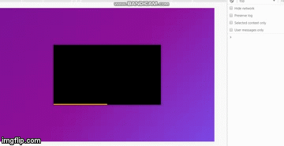
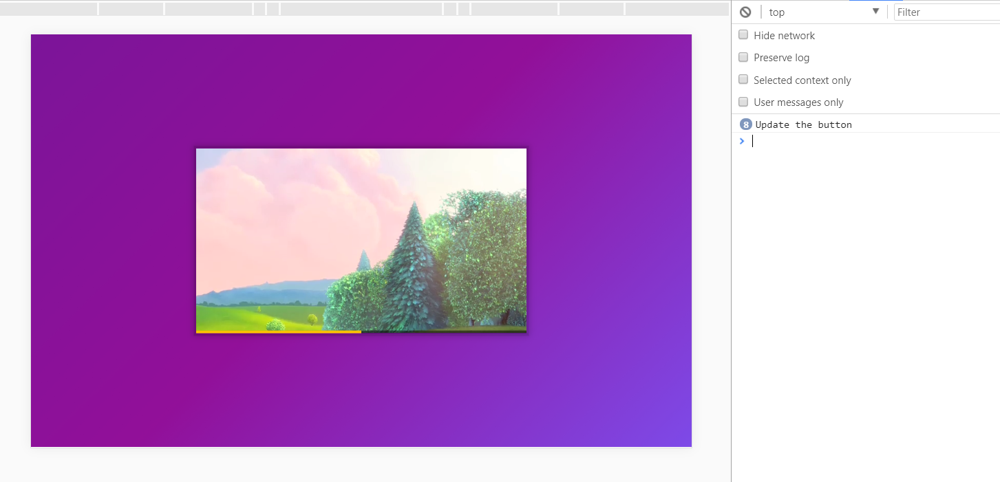
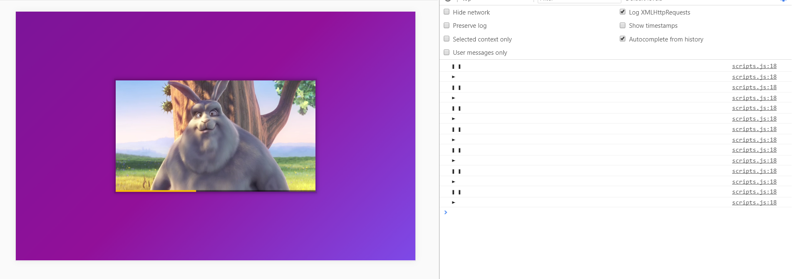

# WESBOS JS TUTORIAL ON HOW ADD FEATURES TO VIDEO

### Features
* pause
* play
* skip by 25s
* progress bar
* icons
* sliders 
* scrub



### Update button
```
    function updateButton(){
  console.log('Update the button');
}

/* Hook up the event listeners */
video.addEventListener('click', togglePlay);
video.addEventListener('play', updateButton);
video.addEventListener('pause', updateButton);
```


### icons
```
    function updateButton() {
    const icon = this.paused ? '►' : '❚ ❚';
    console.log(icon);
    toggle.textContent = icon;
    }
```



