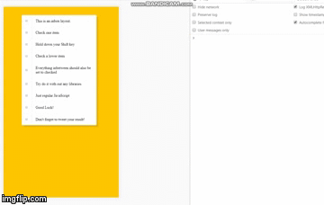
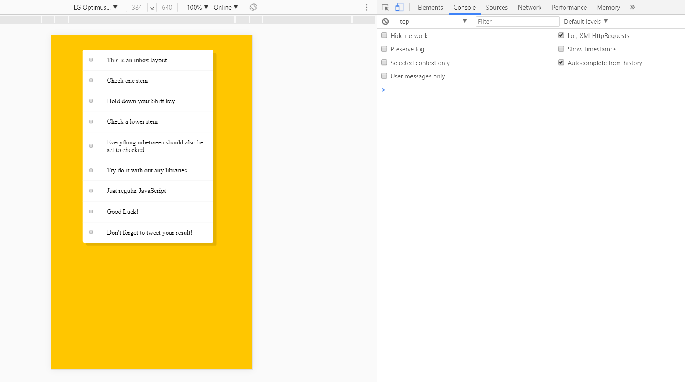
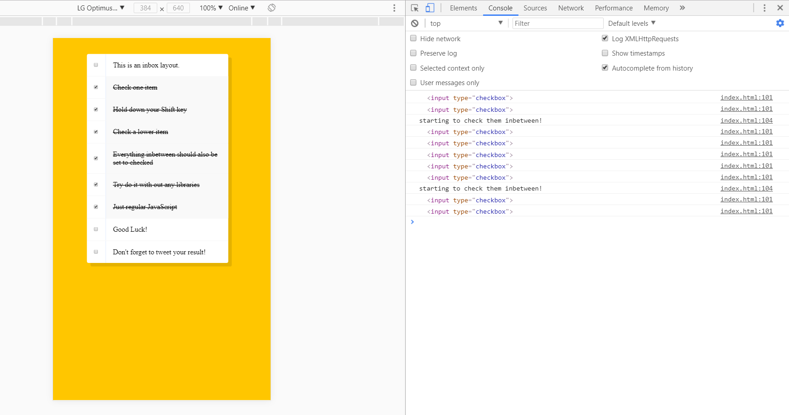

# WESBOS tuts: Hold Shift to Check Multiple Checkboxes

* the final output shows the same functionalities when checking inbox in gmail.
* the inBetween boxes will be automatically checked once the first box and the second boxed are checked while the shiftKey is pressed down.

### Hold Shift to Check Multiple Checkboxes

### Initial Output

### Final Output

