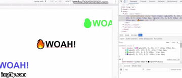
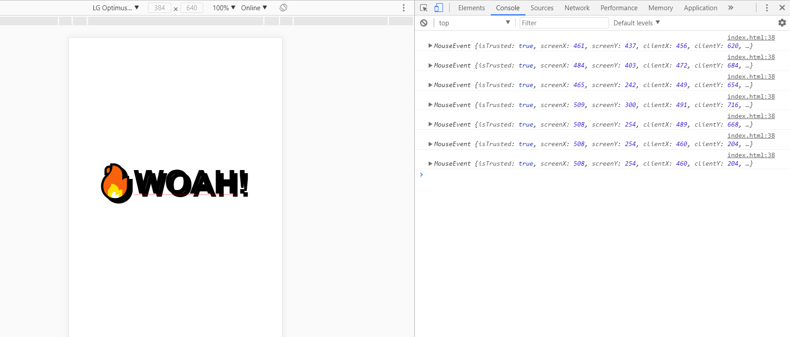
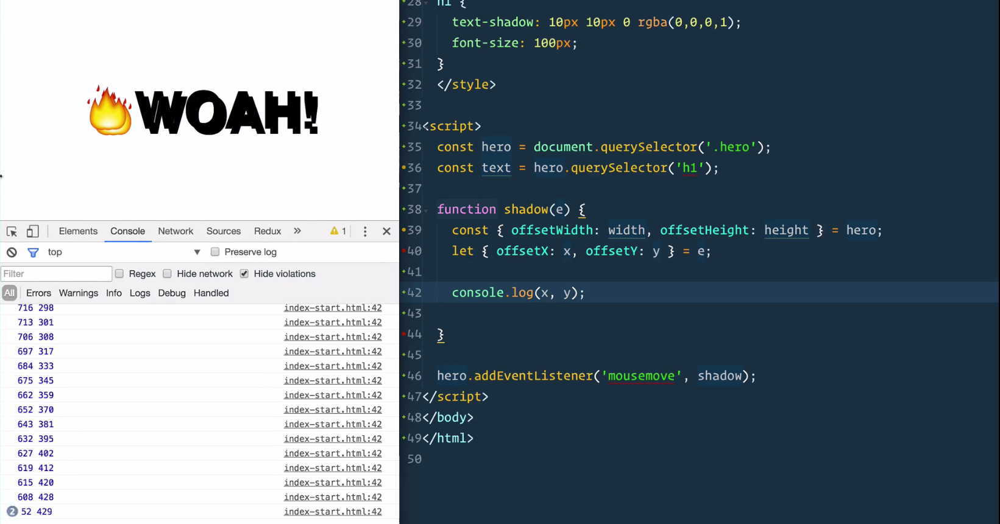
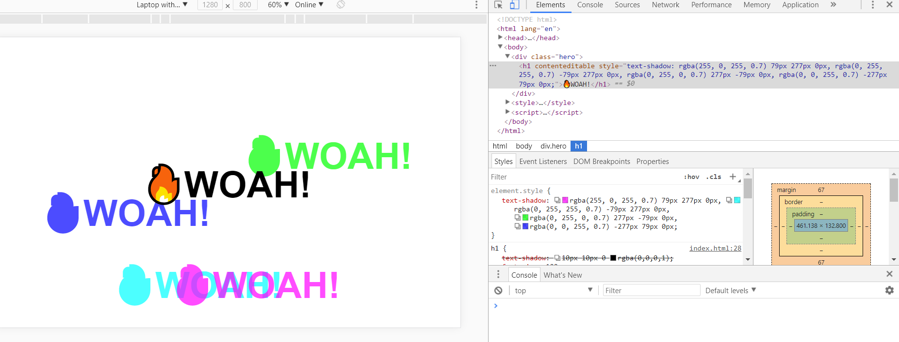

# JS TUTORIAL ON FLEX SHADOW EFFECTS

### Sample


### Initial 


### Adding Mouse event
```
    const hero = document.querySelector('.hero');
    const text = hero.querySelector('h1');
    function shadow(e) {
    console.log(e);
    }

    hero.addEventListener('mousemove', shadow);
```




### Final



