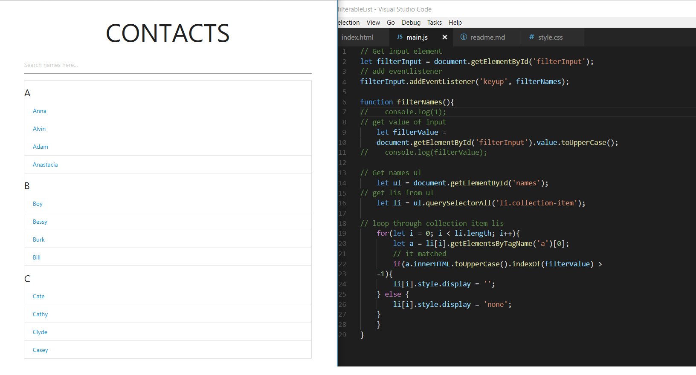

# Simple JS function to filter the names using vanilla-js

* link: http://dealorenzo-filterjs.surge.sh/



```
// Get input element
let filterInput = document.getElementById('filterInput');
// add eventlistener
filterInput.addEventListener('keyup', filterNames);

function filterNames(){
//    console.log(1);
// get value of input
    let filterValue = 
    document.getElementById('filterInput').value.toUpperCase();
//    console.log(filterValue);

// Get names ul
    let ul = document.getElementById('names');
// get lis from ul
    let li = ul.querySelectorAll('li.collection-item');

// loop through collection item lis
    for(let i = 0; i < li.length; i++){
        let a = li[i].getElementsByTagName('a')[0];
        // it matched
        if(a.innerHTML.toUpperCase().indexOf(filterValue) >
    -1){
        li[i].style.display = '';
    } else {
        li[i].style.display = 'none';
    }
    }
}
```

source: https://www.youtube.com/watch?v=G1eW3Oi6uoc