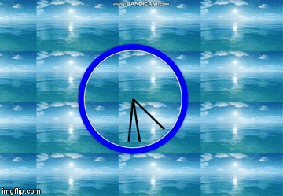
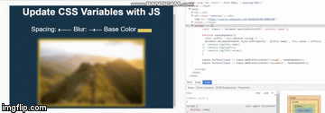

# This is a series of javascript tutorials based on WesBos 30 days of Javascript.
As a code newbie, I have to type along and experiment since I only have a basic understanding of JS. 

# link: http://wesbos.com/

# Big thanks to Wes Bos for the free tutorial. Much appreciated! :-)

## Each folder has a subset of files which includes: 
* index.html
* style.css
* images
* Readme.md

## SAMPLES
* Clock

* CSS Variables

* Flex-panel gallery

