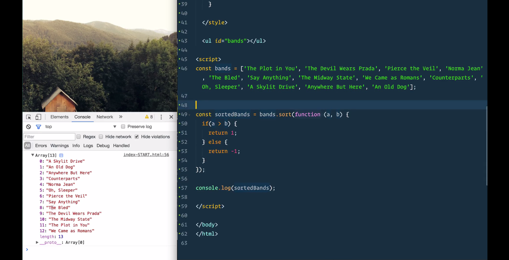
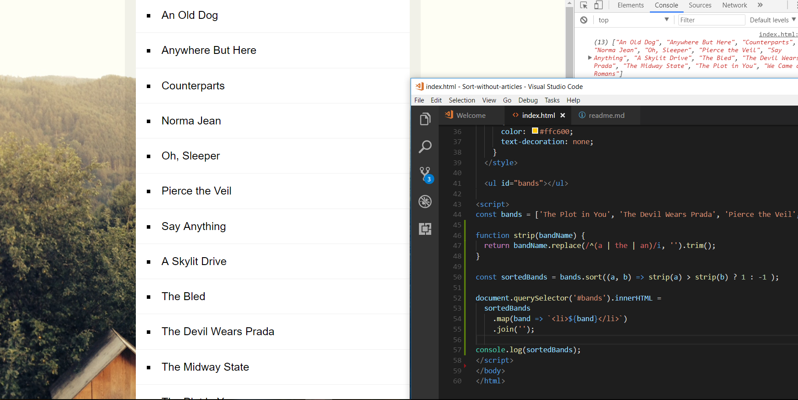

# JS function to sort the list without articles

```
    function strip(bandName) {
  return bandName.replace(/^(a | the | an)/i, '').trim();
}

const sortedBands = bands.sort(function (a, b) {
  if(strip(a) > strip(b)) { 
    return 1;
  } else {
    return -1;
  }
});
console.log(sortedBands);
```
* shorten the code to
```
    function strip(bandName) {
        return bandName.replace(/^(a | the | an)/i, '').trim();
    }
    const sortedBands = bands.sort((a, b) => strip(a) > strip(b) ? 1 : -1 );
```

* initial:



* final:
