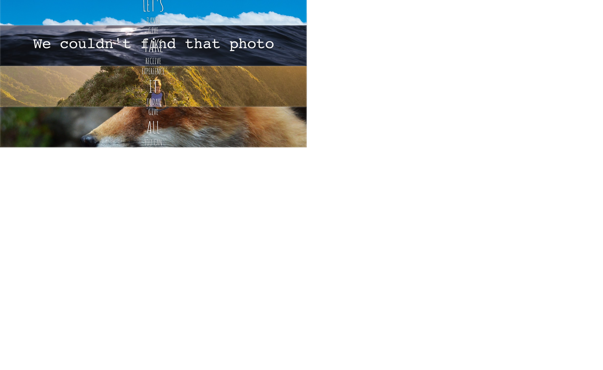
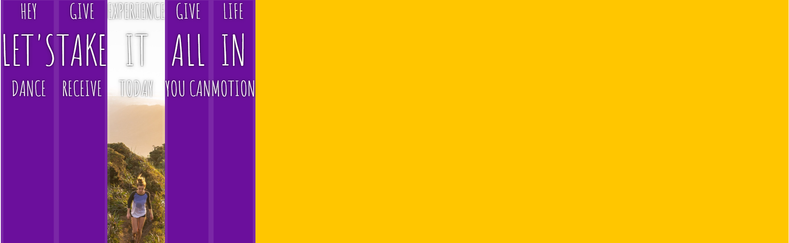
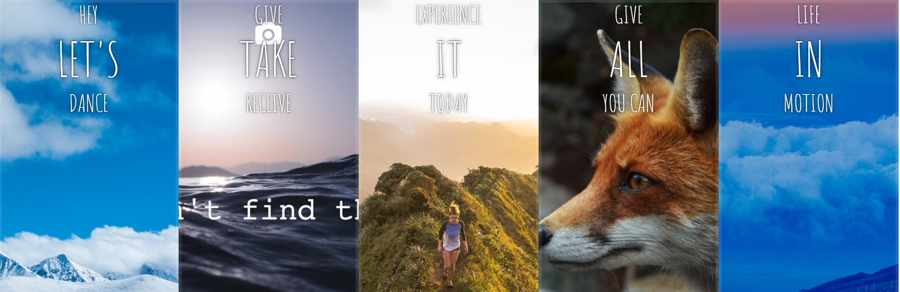
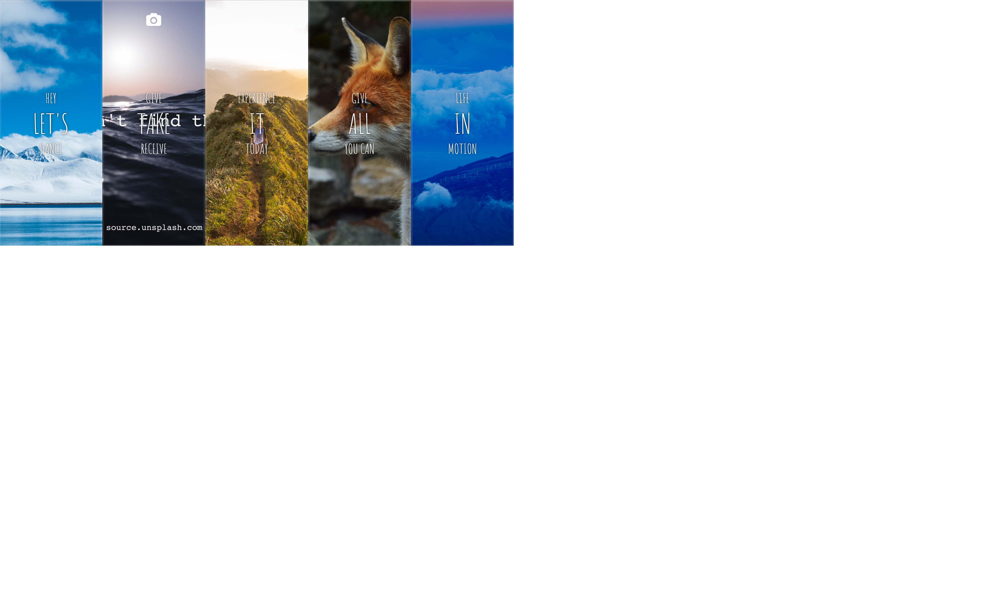

# FLEX-PANEL GALLERY IN JS TUTORIAL

# FEATURES
* Initially, all panels are of the same size. Once the middle text is clicked, it would pop-out a bigger panel and it would display the whole text.


TUTORIAL STEPS:
1. no change


2. add flex:    
```
.panels {
      min-height:100vh;
      overflow: hidden;
      display: flex;
    }
```


3. equal distribution of panels, add
```
.panel {
    flex: 1;
}
````


4. flex item 
```
.panel {
      flex: 1;
      justify-content: center;
      align-items: center;
      display: flex;
      flex-direction: column;
    }
````


5. flex items are now showing the middle text
```
    .panel > *:first-child { transform: translateY(-100%); }
    .panel.open-active > *:first-child { transform: translateY(0); }
    .panel > *:last-child { transform: translateY(100%); }
    .panel.open-active > *:last-child { transform: translateY(0); }
```


6. open panel and it becomes bigger
```
  <script>
    const panels = document.querySelectorAll('.panel');

    function toggleOpen() {
      console.log('Hello');
      this.classList.toggle('open');
    }
    panels.forEach(panel => panel.addEventListener('click', toggleOpen));
  </script>
````


###  Steps for transition:
a. 'click'initiates the eventListener
```
panels.forEach(panel => panel.addEventListener('click', toggleOpen));
```

b. Open transition, this will trigger css:
```
function toggleOpen(){
    this.classList.toggle(_'open'_);
}
```

c. When its finished this next function happens:
```
panels.forEach(panel = > panel.addEventListener('transitioned', 
    toggleActive));
```

d. Then it will toggle open active: 
```
    function toggleActive(e) {
        console.log(e.propertyName);
        if(e.propertyName.includes('flex')){
            this.classList.toggle('open-active');
        }
    }

```


