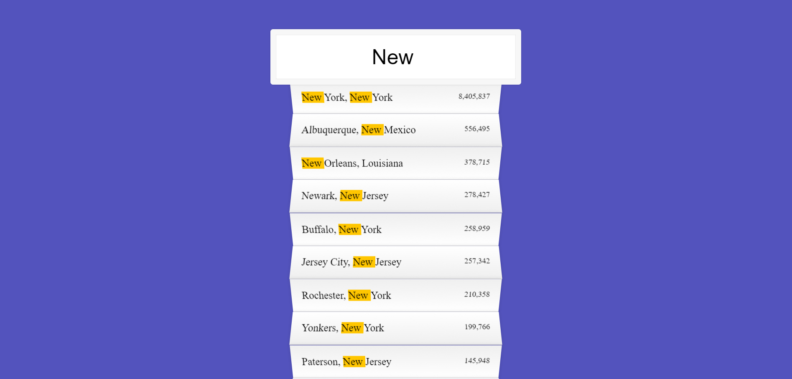

# AJAX TYPE AHEAD TUTORIAL

## FEATURES
* user can type in the search bar which will pull out cities, states and population

* to fetch data, API
```
const endpoint = 'https://gist.githubusercontent.com/Miserlou/c5cd8364bf9b2420bb29/raw/2bf258763cdddd704f8ffd3ea9a3e81d25e2c6f6/cities.json';

function:
fetch(endpoint)
  .then(blob => blob.json())
  .then(data => cities.push(...data));
function findMatches(wordToMatch, cities) {
  return cities.filter(place => {
    // here we need to figure out if the city or state matches what was searched
    const regex = new RegExp(wordToMatch, 'gi');
    return place.city.match(regex) || place.state.match(regex)
  });
}
```

* where "g" is global and "i" for insensitive means its not case-sensitive
This will look for the array that was typed in 
```
    const regex = new RezExp(wordToMatch, 'gi')
```

* for smaller filter
```
    return place.city.match(regex) || place.state.match(regex)
```

* for highlighting text 
```
    const cityName = place.city.replace(regex, `<span class="hl">${this.value}</span>`);
    const stateName = place.state.replace(regex, `<span class="hl">${this.value}</span>
```

* for population with comma
```
function numberWithCommas(x) {
  return x.toString().replace(/\B(?=(\d{3})+(?!\d))/g, ',');
}

    and

under "displayMatches"
    <span class="population">${numberWithCommas(place.population)}</span>
```

